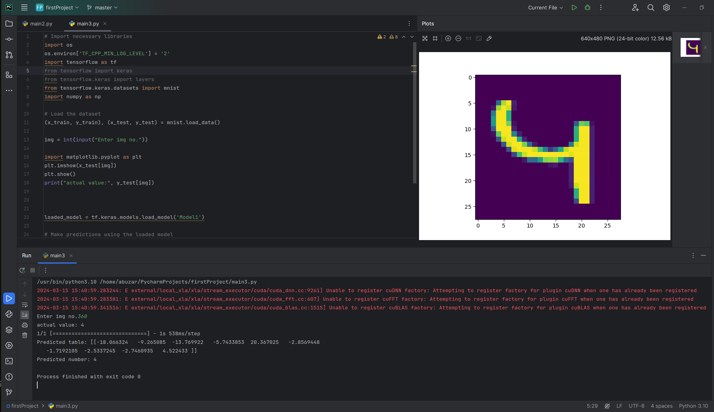

# Digit Classification Model using MNIST Database


This project implements a digit classification model using a simple neural network with the Sequential API and the MNIST database. The model architecture consists of an input layer with 784 (28x28) nodes, followed by two hidden layers with 512 and 256 nodes, both using the ReLU activation function. The output layer has 10 nodes, representing the digits 0-9, without any activation function specified, making it suitable for multi-class classification.

# How to Run
### Clone the repository
```sh
git clone https://github.com/abuzar0013/digit_classificationn.git
```


```sh
pip install requirement.txt
```
```sh
python3 main3.py
```


